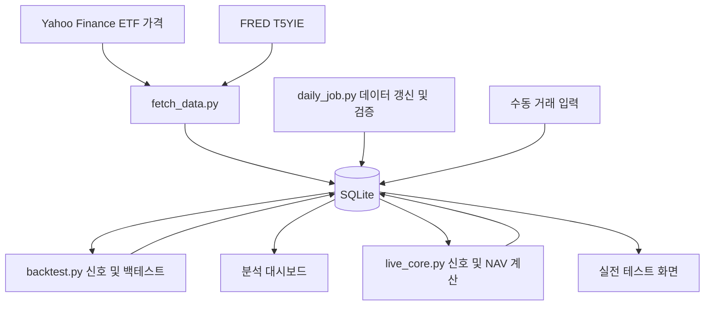

# Regimefolio

성장과 인플레이션 신호를 활용하는 **ETF 로테이션 전략 분석 및 운용 기록 대시보드**입니다.
과거 백테스트, 거래비용에 따른 성과 변화, 월말 신호, Shadow 포트폴리오와 수동 거래 기록을 하나의 프로젝트에서 다룹니다.

**Python · Streamlit · Plotly · pandas · SQLite**

[GitHub 저장소](https://github.com/GamGomYang/regimefolio) · [주요 기능](#주요-기능과-화면) · [로컬 실행](#로컬-실행) · [검증](#검증)

Regimefolio는 **Regime(경제 국면) + Portfolio(포트폴리오)**를 뜻합니다. 현재 분석 대상은 Inflation Compass 전략이며, 화면의 전략명은 그대로 유지했습니다.


> 실제 앱의 백테스트 화면입니다. SPY와 전략의 거래비용 적용 전·후 성과 및 낙폭을 비교합니다. 과거 데이터 기반 시뮬레이션이며 실제 운용 수익률은 아닙니다.

## 프로젝트 소개

백테스트 결과를 확인한 뒤 실제로 전략을 관찰하려면 신호 확인, 거래 기록, 운용 결과 비교가 필요합니다.
이 프로젝트는 데이터 수집과 계산 결과를 SQLite에 저장하고, 웹 화면에서 분석과 운용 기록을 이어서 확인할 수 있도록 구성했습니다.

주요 사용 흐름은 다음과 같습니다.

1. 과거 성과와 낙폭을 SPY와 비교합니다.
2. 거래비용을 변경하며 성과 차이를 확인합니다.
3. 성장·인플레이션 신호와 월말 확정 포지션을 확인합니다.
4. 외부에서 직접 체결한 거래를 입력합니다.
5. 데이터가 있는 기간의 Shadow·실제 기록·SPY를 비교합니다.

자동 주문 기능은 없으며, 실제 거래는 사용자가 직접 수행하고 기록합니다.

## 기반 프로젝트와 개발 범위

이 프로젝트는 기존 GitHub 공개 코드를 수정·확장한 프로젝트입니다. 전략 아이디어의 출처와 기반 코드의 출처를 구분합니다.

- **전략 아이디어:** David Varadi의 Inflation Compass. 참고 글은 하단에 정리했습니다.
- **기반 코드 출처 상태:** 현재 프로젝트 기록만으로는 최초 원본 저장소 URL·참고 커밋·라이선스를 특정할 수 없습니다.
- **개발 범위:** 아래 표는 현재 저장소에서 확인되는 구현입니다. 기반 코드와 개인 수정분의 전체 경계는 확인되지 않아, 기능 전체를 독자 구현으로 표시하지 않았습니다.

| 기능 영역 | 현재 구현 | 관련 코드 |
|---|---|---|
| 데이터 수집·백테스트 | ETF 가격 및 T5YIE 수집, 신호와 성과 계산 | [fetch_data.py](fetch_data.py), [backtest.py](backtest.py) |
| 분석 대시보드 | 비용 조정, 성과 통계, 상대성과, 연도별 수익률, 비중 | [views/dashboard.py](views/dashboard.py) |
| 실전 테스트 | 설정 저장, 신호 조회, 거래 입력, 자산가치 비교 | [views/live_testing.py](views/live_testing.py), [live_core.py](live_core.py) |
| 일별 작업 | 데이터 보충, 검증, 신호 저장, 실행 기록, DB 백업 | [daily_job.py](daily_job.py) |
| 화면 구성 | 페이지 탐색 및 화면 크기에 따른 레이아웃 조정 | [dashboard_app.py](dashboard_app.py) |

## 주요 기능과 화면

### 1. 백테스트 성과 분석

첫 화면의 누적 성과와 낙폭 차트에서 SPY, 거래비용 미반영 전략, 비용 반영 전략을 비교합니다.
누적 성과는 초기값 1을 기준으로 로그 축에 표시하며, 낙폭은 이전 최고점 대비 하락률입니다.

- **그래프:** 누적 성장과 낙폭 비교
- **통계표:** CAGR, 연환산 변동성, Sharpe, 최대낙폭, 최종 배수
- **상대성과:** 전략 자산가치 / SPY 자산가치와 해당 비율의 낙폭
- **연도별 수익률:** 전략·SPY 수익률과 초과수익
- **비용 조정:** 사이드바에서 편도 매매비용을 바꾸어 비교

백테스트 기본 편도비용은 **0.30% = 30bp**이며, 거래되는 금액 비중에 따라 반영합니다.
Sharpe는 현재 코드에서 무위험수익률을 차감하지 않고 계산합니다.

### 2. 경제 국면별 자산 배분


성장과 인플레이션 두 축으로 국면을 구분하고 매월 마지막 거래일의 신호로 다음 보유 구간의 자산을 결정합니다.

| 성장 신호 | 인플레이션 신호 | 목표 자산 | 비중 |
|---|---|---|---|
| 상승 | 상승 | XLE — 에너지 | 100% |
| 상승 | 하락 | XLK — 기술 | 100% |
| 하락 | 상승 | XLU — 유틸리티 | 100% |
| 하락 | 하락 | XLP — 필수소비재 + IEF — 7–10년 미국 국채 | 진입 시 각각 50% |

**성장 상승:** SPY 수정종가가 200거래일 이동평균보다 높습니다.

**인플레이션 상승:** T5YIE가 2.0%를 초과하고, 아래 조건 중 하나 이상을 충족합니다.

- T5YIE가 60거래일 전보다 높음
- 인플레이션 확인 지표의 60거래일 선형회귀 기울기가 양수

확인 지표는 아래 두 바스켓의 일별 수익률을 누적한 값의 비율입니다.

- 긍정 바스켓: 0.5 × XLE + 1/6 × XLI + 1/6 × XLF + 1/6 × XLB
- 부정 바스켓: 1/3 × XLU + 1/3 × XLV + 1/3 × XLP
- 확인 지표: 긍정 바스켓 누적 성장 / 부정 바스켓 누적 성장

### 3. 포트폴리오 변경 이력


시간에 따른 ETF 비중으로 자산 교체 시점과 보유 기간을 확인합니다.
대시보드의 `비중` 탭에서 각 ETF의 보유 비중을 색상으로 구분해 조회합니다.

### 4. 운용 설정 및 신호 확인


`실전 테스트` 페이지에서 시작일, 초기자금, Shadow 편도비용을 저장합니다.
화면에서는 최근 작업 상태, 마지막 가격 날짜, 현재 예상 포지션, 최근 월말 확정 포지션을 확인합니다.
성장·인플레이션 신호와 함께 T5YIE, SPY 가격, 200일 이동평균을 표시해 판단 근거를 확인할 수 있습니다.

Shadow는 전략 규칙에 따른 모의 포트폴리오입니다. 데이터가 존재하면 Shadow·실제 거래 기록·SPY의 자산가치를 각 시계열의 최초값으로 나누어 비교합니다.

> 제공된 화면 예시의 실행 기록은 2026-09-13, 마지막 가격 날짜는 2026-08-12입니다. `SUCCESS`는 작업 완료 상태이며 데이터가 최신이라는 보장은 아닙니다. 화면은 운용 설정 및 신호 조회 예시로 해석해야 합니다.

### 5. 수동 거래 기록 및 작업 이력


거래일, 신호일, 티커, 매수·매도, 수량, 평균 체결가, 수수료와 메모를 입력합니다.
저장한 거래는 실제 포트폴리오 자산가치 계산에 사용됩니다.
최근 실행 기록에서는 시작·종료 시각, 성공·실패 상태, 가격·FRED 데이터의 마지막 날짜와 처리 메시지를 확인합니다.

스크린샷은 2026-09-13에 캡처한 실제 앱 화면입니다. [이미지 목록 및 촬영 정보](docs/images/README.md)에서 각 파일의 내용을 확인할 수 있습니다.

## 시스템 구조와 설계



| 설계 과제 | 구현 방식 | 목적 |
|---|---|---|
| 비용을 바꿀 때마다 전체 신호를 다시 계산하는 문제 | 비용 미반영 수익률과 턴오버를 따로 저장 | 저장 결과로 비용 시나리오 비교 |
| 반복 작업으로 인한 중복 저장 | 가격 upsert, 신호 중복 방지, 실행 스크립트의 디렉터리 잠금 | 재실행 가능한 일별 처리 |
| 월말과 다음 거래일 판정 | 미국 거래소 캘린더 사용 | 달력상 말일과 실제 거래일 구분 |
| 불완전한 데이터로 계산이 진행되는 문제 | 데이터 검증 오류 시 작업 실패 및 기록 | 오류 원인 추적과 계산 중단 |
| 로컬 DB 복구 | 정상 실행 후 날짜별 백업, 최근 7개 유지 | 최근 저장 상태 복구 지원 |

### 주요 저장 테이블

| 테이블 | 용도 |
|---|---|
| `prices`, `fred_series` | ETF 수정종가와 T5YIE |
| `backtest_daily_returns` | 비용 미반영 전략·SPY 일별 수익률 |
| `backtest_turnover_events` | 리밸런싱별 턴오버 |
| `backtest_weights` | 일별 ETF 비중 |
| `backtest_equity`, `backtest_yearly`, `backtest_positions` | 기본 비용 기준 결과 |
| `live_settings`, `live_signal_snapshots` | 운용 설정과 신호 기록 |
| `live_trades`, `live_daily_nav` | 수동 거래와 포트폴리오 자산가치 |
| `live_runs`, `live_data_issues` | 실행 이력과 데이터 검증 결과 |

## 로컬 실행

먼저 저장소를 복제하고 프로젝트 폴더로 이동합니다.

```bash
git clone https://github.com/GamGomYang/regimefolio.git
cd regimefolio
```

이후 명령은 저장소 루트에서 실행합니다. 의존성 버전은 [requirements.txt](requirements.txt)에 고정되어 있습니다.

### 1. 가상환경과 패키지 설치

```bash
python3 -m venv .venv
source .venv/bin/activate
python -m pip install -r requirements.txt
```

### 2. 데이터 준비와 백테스트

```bash
python fetch_data.py
python backtest.py
python daily_job.py --skip-fetch
```

`fetch_data.py`는 네트워크를 통해 데이터를 수집하고, `backtest.py`는 대시보드에 필요한 결과 테이블을 저장합니다.
`--skip-fetch`는 기존 DB로 실전 테스트 계산을 실행하는 옵션이며, 실행 기록과 신호·NAV를 갱신하므로 읽기 전용 명령이 아닙니다.

### 3. 웹 화면 실행

```bash
streamlit run dashboard_app.py
```

`대시보드`, `실전 테스트`, `전략 설명` 페이지를 탐색할 수 있습니다.
실전 테스트의 설정을 저장한 뒤, 이후 데이터와 운용 결과를 갱신하려면 다음을 실행합니다.

```bash
python daily_job.py
```

분석 대시보드의 백테스트 결과까지 새 데이터에 맞추려면 `python backtest.py`를 별도로 실행하고 Streamlit 앱을 재시작해 캐시를 갱신합니다.

### 4. macOS 자동 실행 — 선택 사항

현재 자동 실행 파일에는 개발 환경의 절대경로가 포함되어 있습니다.
설치 전에 아래 파일의 프로젝트 경로와 사용자 LaunchAgents 경로를 자신의 환경에 맞춰 수정해야 합니다.

- `launch_daily.sh`
- `install_launchd.sh`
- `uninstall_launchd.sh`
- `launchd/com.inflation-compass.daily.plist`

```bash
./launch_daily.sh
./install_launchd.sh
launchctl print "gui/$(id -u)/com.inflation-compass.daily"
```

설치 후 로그인 시 한 번, 이후 Mac이 깨어 있는 동안 2시간 간격으로 실행하도록 설정되어 있습니다.
로그는 `logs/daily_job.log`, `logs/daily_job_error.log`에서 확인합니다.
자동 실행을 중지하려면 다음 명령을 실행합니다.

```bash
./uninstall_launchd.sh
```

DB 백업은 `data/backups/`에 저장됩니다. Mac이 꺼져 있던 기간의 데이터는 다음 실행에서 보충할 수 있지만, 실제 매매가 소급 체결되는 것은 아닙니다.

## 저장소에 포함하는 파일

소스 코드, 테스트, 의존성 목록, 문서와 포트폴리오 이미지를 Git으로 관리합니다.
로컬 DB와 백업, 실행 로그, `results/` 실험 산출물, `backtest_report.txt`, 가상환경 및 개인 설정은 `.gitignore`로 제외합니다.
DB가 없는 새 환경에서는 위 데이터 준비 명령으로 생성해야 합니다.
`log.txt`는 실행 로그가 아닌 구현·실험 이력 문서이므로 포함합니다.

## 검증

```bash
python -m pytest -q
```

[기존 통합 테스트](tests/test_live_blackbox.py)는 임시 DB와 합성 데이터를 사용해 다음 동작을 확인하도록 작성되어 있습니다.

- 일별 작업으로 신호 및 Shadow·SPY 자산가치 생성
- 같은 작업 재실행 시 신호 개수 유지
- 수동 매수 입력 후 실제 자산가치와 현금 계산
- 최신 날짜의 필수 ETF 가격 누락 시 작업 실패 기록

로컬 검증 결과(2026-09-13): `2 passed`. 임시 DB 기반의 기존 통합 테스트 2개가 통과했습니다.

이 테스트 범위는 외부 데이터 수집의 가용성, 웹 화면 전체, 전략 수익성의 검증을 의미하지 않습니다.

## 데이터와 분석의 한계

- ETF 가격은 Yahoo Finance의 수정종가, 인플레이션 입력은 FRED의 T5YIE를 사용합니다.
- 사용 티커: SPY, XLE, XLK, XLU, XLP, IEF, XLI, XLF, XLB, XLV.
- 분석 구간은 데이터 가용성과 이동평균·모멘텀의 준비 기간에 따라 결정됩니다. 기존 문서의 기준 시작점은 2003-03-31이며, 결과를 게시할 때 실제 계산 시작·종료일을 함께 확인해야 합니다.
- 백테스트는 과거 데이터와 비용 가정에 따른 시뮬레이션입니다. 수동 거래의 체결가·시점은 백테스트 가정과 다를 수 있습니다.
- 기본 백테스트의 입력은 현재 조회한 데이터입니다. 과거 시점에 알려진 데이터만 사용한 검증과 구분해야 합니다. 관련 실험 코드는 `alfred_vintage_backtest.py`, `t5yie_scenarios.py`에 있습니다.
- `SUCCESS`와 데이터 최신성은 별도로 확인해야 합니다. 특히 `--skip-fetch`는 새 데이터를 수집하지 않습니다.
- 개인 거래와 설정이 로컬 DB에 저장됩니다. 공개용 화면과 데이터를 준비할 때 실제 개인 기록 포함 여부를 확인해야 합니다.

## 참고 자료 및 출처

다음은 기존 프로젝트에서 참고한 전략 자료입니다.

- [David Varadi — The Inflation Compass Model](https://cssanalytics.wordpress.com/2026/07/27/the-inflation-compass-model/)
- [Allocate Smartly — Taming the Wildcard: David Varadi’s Inflation Compass](https://allocatesmartly.com/taming-the-wildcard-david-varadis-inflation-compass/)

기반 코드의 원본 저장소 및 라이선스는 현재 확인되지 않았습니다. 전략 참고 글은 코드 라이선스를 대신하지 않으며, 이 README는 코드 전체에 새로운 라이선스를 부여하지 않습니다.

구현 및 실험 이력은 [log.txt](log.txt), 기존 분석 요약은 [summary.md](summary.md)에 있습니다.
