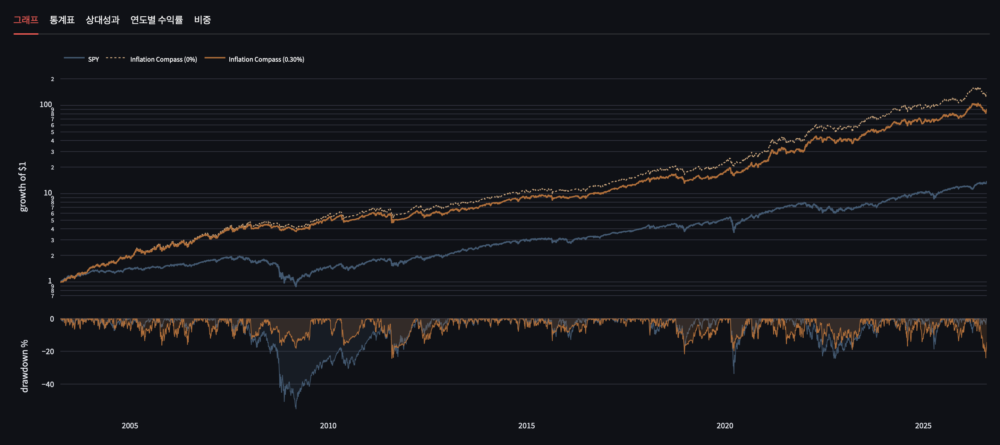
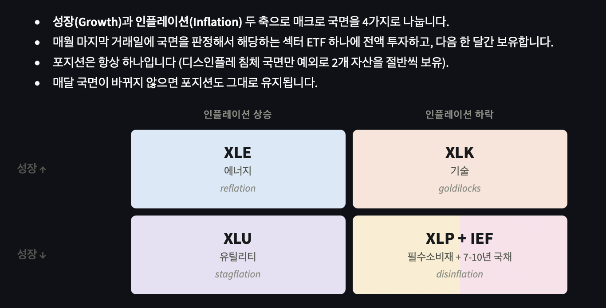
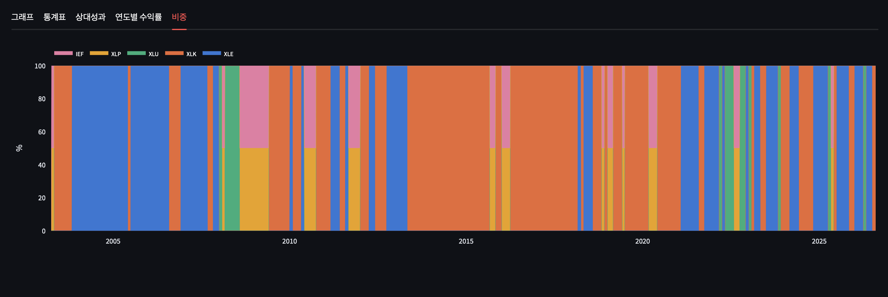
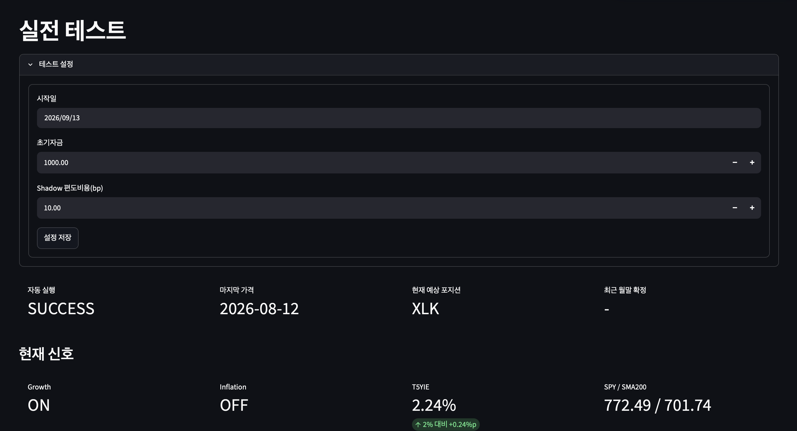
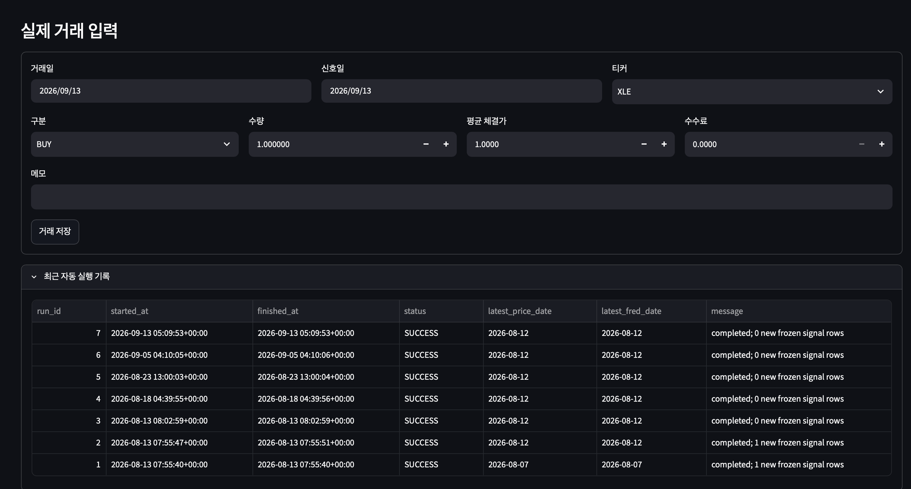

# Regimefolio

**경기와 인플레이션의 방향을 읽고 매월 투자할 ETF를 결정하는 전략**

Regimefolio는 Inflation Compass 전략을 백테스트하고 월말 신호와 운용 기록을 확인하는 대시보드입니다.
‘어떤 자산을 보유할까?’라는 판단을 두 가지 신호와 명확한 배분 규칙으로 정리합니다.



*실제 앱 화면 · SPY와 거래비용 적용 전·후 전략 비교 · 과거 데이터 기반 백테스트*

## 왜 이 전략인가

경제 환경이 달라질 때마다 같은 섹터가 시장을 이끌지는 않는다는 가설에서 출발합니다.
성장과 인플레이션을 함께 관찰해, 현재 국면에 대응하는 자산으로 투자 대상을 전환합니다.

- **판단 근거 명확** 가격 추세, 기대인플레이션, 섹터 상대성과로 신호를 계산합니다.
- **월말에 운용 점검** 매일 매매할 필요 없이 월 단위로 목표 포지션을 확인합니다.
- **성과와 비용 함께 고려** 수익률뿐 아니라 낙폭, SPY 대비 상대성과, 매매비용의 영향을 비교합니다.
- **분석을 운용 기록으로 연결** 자동 데이터 갱신, 신호 저장, 모의 포트폴리오와 수동 거래 기록을 지원합니다.

## 네 가지 국면에 따른 전환



| 성장 신호 | 인플레이션 신호 | 목표 자산 | 배분의 취지 |
|---|---|---|---|
| 상승 | 상승 | **XLE** — 에너지 | 성장과 물가 압력이 함께 높아지는 환경에 대응 |
| 상승 | 하락 | **XLK** — 기술 | 성장세와 인플레이션 압력 완화의 조합에 대응 |
| 하락 | 상승 | **XLU** — 유틸리티 | 성장 둔화 국면에서 방어적 섹터 선택 |
| 하락 | 하락 | **XLP + IEF** — 필수소비재·미국 국채 | 주식 방어 섹터와 채권을 각각 50% 배분 |

이 배분은 [David Varadi의 Inflation Compass](https://cssanalytics.wordpress.com/2026/07/27/the-inflation-compass-model/)가 제시한 전략 가설입니다.
국면 이름은 모델의 분류이며, 실제 GDP 성장률이나 소비자물가의 상승·하락을 직접 판정하는 것은 아닙니다.

## 신호는 어떻게 계산하나

### 1. 성장 — 시장이 장기 추세 위에 있는가

SPY 수정종가를 최근 200거래일 평균과 비교합니다.

$$
\mathrm{SMA}_{200,t}=\frac{1}{200}\sum_{k=0}^{199}P^{\mathrm{SPY}}_{t-k},
\qquad G_t=\mathbf{1}\!\left[P^{\mathrm{SPY}}_t>\mathrm{SMA}_{200,t}\right]
$$

평균보다 높으면 성장 신호를 `ON`, 그렇지 않으면 `OFF`로 분류합니다.
여기서 $\mathbf{1}[\cdot]$은 조건이 참일 때 1, 거짓일 때 0입니다.

### 2. 인플레이션 — 수준이 높고 상승 압력이 있는가

$B_t$는 T5YIE, 즉 채권시장에서 관측한 5년 기대인플레이션율입니다.
입력값 `2.0`은 연율 2%를 뜻합니다.

$$
I_t=\mathbf{1}[B_t>2.0]\;\land\;
\left(\mathbf{1}[B_t>B_{t-60}]\;\lor\;\mathbf{1}[\hat\beta_t>0]\right)
$$

**2% 초과**를 기본 조건으로 두고, 기대인플레이션의 60거래일 변화 또는 섹터 확인 지표의 기울기 중 하나가 양수이면 `ON`입니다.
기대인플레이션 수준과 시장의 움직임을 함께 반영하는 구조입니다.

<details>
<summary><strong>섹터 확인 지표와 회귀 기울기 수식</strong></summary>

각 ETF의 일별 수정종가 수익률을 $r_{i,t}$라고 하면 두 바스켓을 다음과 같이 구성합니다.

$$
r_t^+=\frac12r_{\mathrm{XLE},t}+\frac16\left(r_{\mathrm{XLI},t}+r_{\mathrm{XLF},t}+r_{\mathrm{XLB},t}\right)
$$

$$
r_t^-=\frac13\left(r_{\mathrm{XLU},t}+r_{\mathrm{XLV},t}+r_{\mathrm{XLP},t}\right),
\qquad C_t=\frac{\prod_{s\le t}(1+r_s^+)}{\prod_{s\le t}(1+r_s^-)}
$$

$C_t$가 상승하면 에너지·산업재·금융·소재 바스켓이 방어 섹터 바스켓보다 강하다는 뜻입니다.
최근 60개 값에 직선을 맞추어 기울기를 계산합니다.

$$
\hat\beta_t=
\frac{\sum_{j=0}^{59}(j-\bar j)(C_{t-59+j}-\bar C_t)}
{\sum_{j=0}^{59}(j-\bar j)^2}
$$

$\bar j=29.5$, $\bar C_t$는 해당 60개 값의 평균입니다. 필요한 관측치가 확보된 구간에서만 신호를 사용합니다.

</details>

### 3. 월말 — 신호를 목표 포지션으로 바꾸기

미국 마지막 거래일의 $(G_t,I_t)$ 조합으로 다음 보유 구간의 자산을 결정합니다.
예를 들어 `Growth ON / Inflation OFF`이면 XLK가 목표 자산입니다.
목표 자산이 같으면 섹터 전환 없이 보유를 이어갑니다.



*비중 화면에서 어떤 자산을 얼마나 오래 보유했는지, 국면 전환이 얼마나 자주 발생했는지 확인합니다.*

## 수익률만큼 중요한 낙폭과 거래비용

대시보드에서 누적 성과, 최대낙폭, 연도별 수익률, SPY 대비 상대성과를 함께 비교합니다.
매매비용은 기본 **편도 0.30%(30bp)**이며 화면에서 변경할 수 있습니다.

$$
\tau_t=\sum_i\left|w^{\mathrm{target}}_{i,t}-w^{\mathrm{previous}}_{i,t}\right|,
\qquad r_t^{\mathrm{net}}=(1+r_t^{\mathrm{gross}})(1-c\tau_t)-1
$$

$\tau_t$는 목표 비중 변화의 합, $c$는 편도 비용률입니다.
한 ETF를 전량 매도하고 다른 ETF를 전량 매수하면 $\tau_t=2$이므로, 편도 0.30%에서 자산가치에 적용하는 비용은 0.60%입니다.
이 비용은 리밸런싱 이후 첫 거래일에 반영합니다.

## 자동으로 갱신하고, 월말에 확인하기



macOS 자동 실행을 설치하면 **로그인 시 한 번, 이후 깨어 있는 동안 2시간 간격**으로 작업을 실행합니다.

1. ETF 가격과 기대인플레이션 데이터를 보충합니다.
2. 데이터를 검증하고 신호와 모의 포트폴리오를 갱신합니다.
3. 실행 결과를 기록하고 DB를 백업합니다. 최근 7개의 날짜별 백업을 유지합니다.

사용자는 월말 확정 신호와 목표 포지션을 확인한 뒤 직접 매매하고, 체결 내역을 입력합니다.
**자동화 대상은 데이터 처리와 기록이며, 주문은 자동으로 보내지 않습니다.**



시작일·초기자금·비용을 설정하면 전략에 따른 **Shadow(모의 포트폴리오)**를 추적할 수 있습니다.
거래 기록과 가격 데이터가 쌓이면 실제 기록 기반 자산가치를 Shadow·SPY와 비교합니다.

## 시작하기

```bash
git clone https://github.com/GamGomYang/regimefolio.git
cd regimefolio
python3 -m venv .venv
source .venv/bin/activate
pip install -r requirements.txt
python fetch_data.py
python backtest.py
python daily_job.py --skip-fetch
streamlit run dashboard_app.py
```

macOS 자동 실행 설치:

```bash
./scripts/macos/install.sh
```

설치 시 현재 프로젝트 위치를 절대경로로 등록합니다.
운용 설정, 자동 실행 중지, 실험 및 테스트 명령은 [사용 가이드](docs/usage.md)에 정리했습니다.

## 결과를 해석할 때

- **섹터 집중 전략입니다.** 선택한 섹터가 부진하면 시장 대비 장기간 뒤처질 수 있으며, 좋은 백테스트가 미래 성과를 보장하지 않습니다.
- **체결 가정이 중요합니다.** 기본 백테스트는 월말 신호 이후의 종가 수익률을 적용합니다. Shadow는 다음 거래일 종가로 진입하므로 두 결과는 동일하지 않습니다. XLP·IEF도 기본 백테스트는 일별 고정 비중, Shadow는 월별 비중 설정 후 수량 보유 방식입니다.
- **기대인플레이션도 완전한 입력은 아닙니다.** 유동성에 따른 왜곡과 과거 데이터 가용성을 고려해야 합니다. [독립 리뷰](https://allocatesmartly.com/taming-the-wildcard-david-varadis-inflation-compass/)와 `research/`의 시차·빈티지 실험으로 추가 검토할 수 있습니다.

---

전략: [David Varadi — Inflation Compass](https://cssanalytics.wordpress.com/2026/07/27/the-inflation-compass-model/) · 데이터: Yahoo Finance / FRED T5YIE
